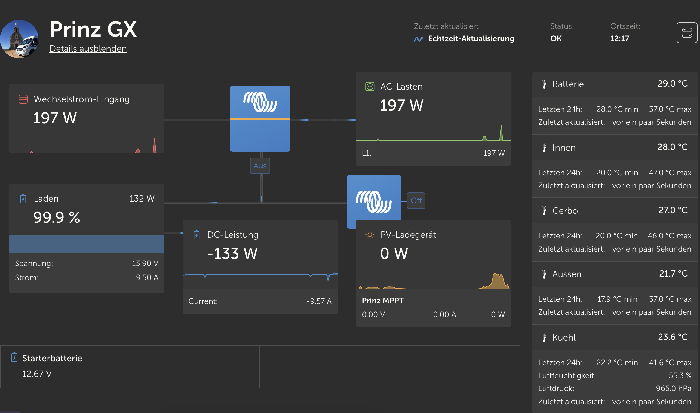
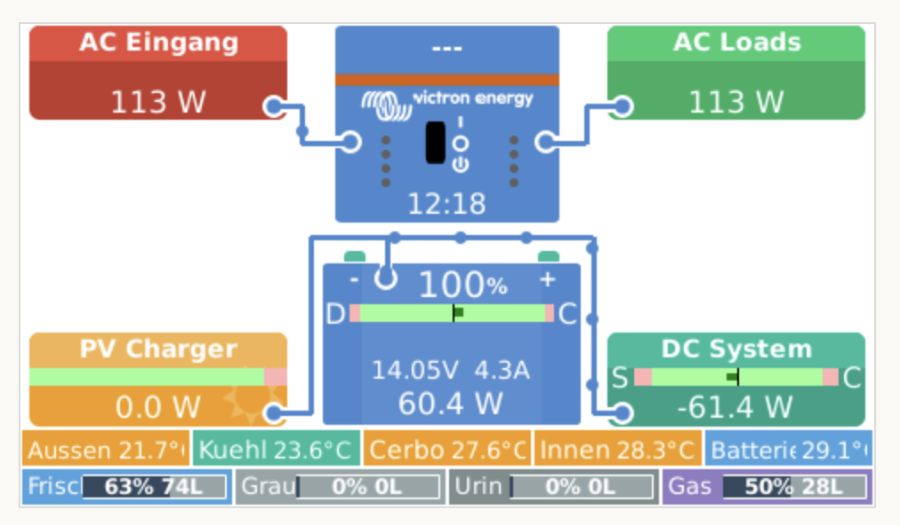
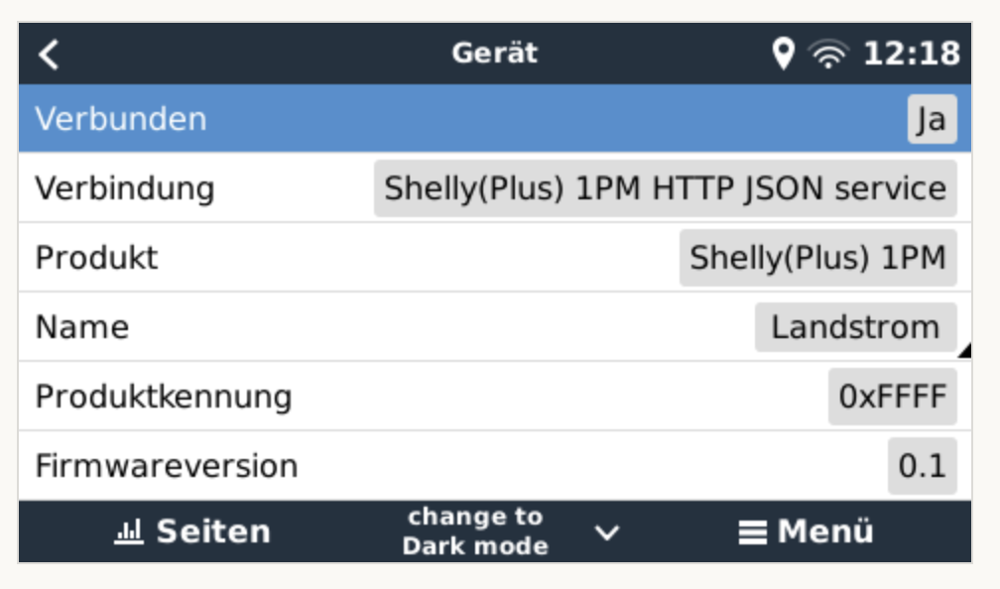
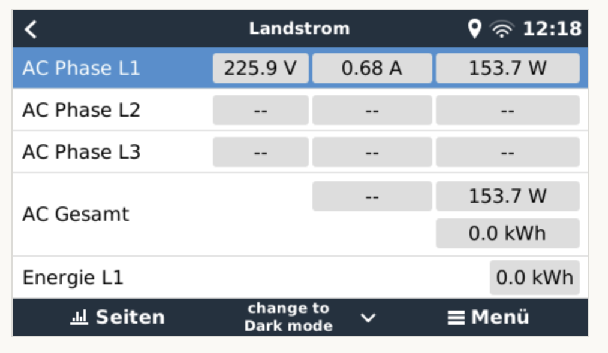

# dbus-shelly-1pm-plus-shore-power
Integrate Shelly Plus 1PM into Victron Energies Venus OS

## Purpose
With the scripts in this repo it should be easy possible to install, uninstall, restart a service that connects the Shelly Plus 1PM to the VenusOS and GX devices from Victron. 

Idea is inspired on @Halmand project linked below. I use the Shelly to meter shore power for my Camper Van.

I changed the original project to grid power instead of pvinverter and reduced to one (L1) phase only.

When the shore power is disconnected the Shelly will not response. In this case ZERO values are returned and the serial number is set to "Offline"

## Inspiration
This project is a fork of https://github.com/Halmand/dbus-shelly-1pm-and-pm1-Plus-pvinverter-multi-instance to use the Shelly Plus 1PM to meter the shore power of my camper van.

- https://shelly-api-docs.shelly.cloud/gen1/#shelly1-shelly1pm
- https://github.com/victronenergy/venus/wiki/dbus#grid-and-genset-meter

### Details / Process
So what is the script doing:
- Running as a service
- connecting to DBus of the Venus OS `com.victronenergy.pvinverter.http_{DeviceInstanceID_from_config}`
- After successful DBus connection Shelly Plus 1PM is accessed via REST-API
  the /status is requetsed and a JSON is returned with all details
  A sample JSON file from Shelly 1PM can be found [here](docs/shelly1pm-plus-status-sample.json)
- Serial/MAC is taken from the response as device serial
- In case the request is timed out (shore power is not attached) all values are set to 0 (ZERO) and the serial number is set to "Offline"
- Paths are added to the DBus with default value 0 - including some settings like name, etc
- After that a "loop" is started which pulls Shelly 1PM data every 5sec from the REST-API and updates the values in the DBus

Thats it 😄

### Pictures
#### Overview in VRM Portal
 
#### Flowmeter on Cerbos GX

#### Cerbos GX Device List

#### Shore power device

#### Shore power values


## Install & Configuration
### Get the code
Just grap a copy of the main branche and copy them to a folder under `/data/` e.g. `/data/dbus-shelly-plus-1pm-shore-power`.
After that call the install.sh script.

The following script should do everything for you:
```
wget https://github.com/ubarni/dbus-shelly-1pm-plus-shore-power/archive/refs/heads/main.zip
unzip main.zip "dbus-shelly-1pm-plus-shore-power-main/*" -d /data
mv /data/dbus-shelly-1pm-plus-shore-power-main /data/dbus-shelly-1pm-plus-shore-power
chmod a+x /data/dbus-shelly-1pm-plus-shore-power/install.sh
/data/dbus-shelly-1pm-plus-shore-power/install.sh
rm main.zip
```
⚠️ Check configuration after that - because service is already installed an running and with wrong connection data (host, username, pwd) you will spam the log-file

### Change config.ini
Within the project there is a file `/data/dbus-shelly-plus-1pm-shore-power/config.ini` - just change the values - most important is the deviceinstance, custom name and host, username and password in section "SHELLY". More details below:


| Section  | Config vlaue | Explanation |
| ------------- | ------------- | ------------- |
| DEFAULT  | SignOfLifeLog  | Time in minutes how often a status is added to the log-file `current.log` with log-level INFO |
| DEFAULT  | Deviceinstance | Unique ID identifying the shelly 1pm in Venus OS |
| DEFAULT  | CustomName | Name shown in Remote Console (e.g. name of pv inverter) |
| SHELLY  | Host | IP or hostname of Shelly Plus 1PM web-interface |
| SHELLY  | Username | Username for htaccess login - leave blank if no username/password required |
| SHELLY  | Password | Password for htaccess login - leave blank if no username/password required |

## Uninstall:

```
/data/dbus-shelly-1pm-plus-shore-power/uninstall.sh
rm -r /data/dbus-shelly-1pm-plus-shore-power
```

## Used documentation
- https://github.com/victronenergy/venus/wiki/dbus#pv-inverters   DBus paths for Victron namespace
- https://github.com/victronenergy/venus/wiki/dbus-api   DBus API from Victron
- https://www.victronenergy.com/live/ccgx:root_access   How to get root access on GX device/Venus OS
- https://shelly-api-docs.shelly.cloud/gen1/#shelly1-shelly1pm Shelly API documentation
